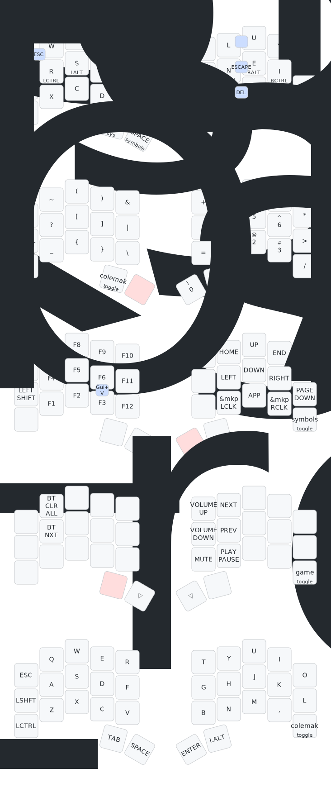

# Riccardo's 34 key keymap

## Objectives

- close as possible to the standard layout to minimize cognitive load for new users. Fingers tend to want to go to those positions naturally.
- logical layout e.g. numpad with operators close by
- used for:
  - normal typing
  - lots of programming (vscode/zed/helix)
  - lots of excel

## Layout

The starting point uses standard qwerty layout.

Homerow mods for modifiers

Symbol layer with a numpad on the right side of the keyboard

Navigation layer with inverted T arrow keys and function keys

## Alpha keys

Same format as standard keyboard.
Replace semicolon with quote, which moves to symbol layer.

## Thumbs

Space and symbol layer (hold) on left thumb
Tab on other left thumb

Enter and navigation layer (hold) on right thumb
Backspace/delete on other right thumb

## Homerow mods

Similar order as standard keyboard.
Shift on pinky
Ctrl on ring finger
Alt on middle finger
Gui on index finger

## Symbol layer

Numpad on the right side of the keyboard together with +- \*/ \=. close by

Symbols are behind the numbers so you can shift to get the symbols. These use the same symbols as the number row on a standard keyboard

Brackets are in a nice order on the left side

Other missing symbol keys or highly used so we dont need shift are also added namely & | \_ < > \\

## Navigation layer

Inverted T arrow keys
Home End Page Up and Page Down on right hand
Function keys on left hand

## Other additions

There is also a media layer which is sometimes used

Homerow mods make multiple mods shortcuts easier to press e.g.

- vscode CTRL+SHIFT+P or META+SHIFT+P
- excel CTRL+SHIFT+7

ESCAPE is on j+k, or holding Q

CAPS_WORD is on l+' or on nav layer

DELETE is on SHIFT+BACKSPACE or m+,

There is a lock layer for symbol layer, which locks you into the layer until you release the layer key. This allows for inputting numbers without holding layer key.

## One hand left / mouse mode

When using the mouse for scrolling, navigating, we can still use some typically used shortcuts with the left hand:

- hold Q for escape
- ctrl+c copy, ctrl+v paste, ctrl+z undo. Hence why ctrl is on the ring finger. We do sacrifice ctrl+x cut which is not used as much.
- alt+tab for switching windows
